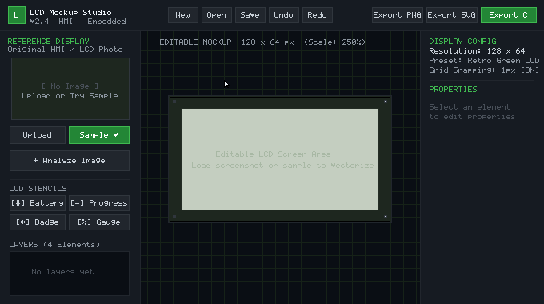
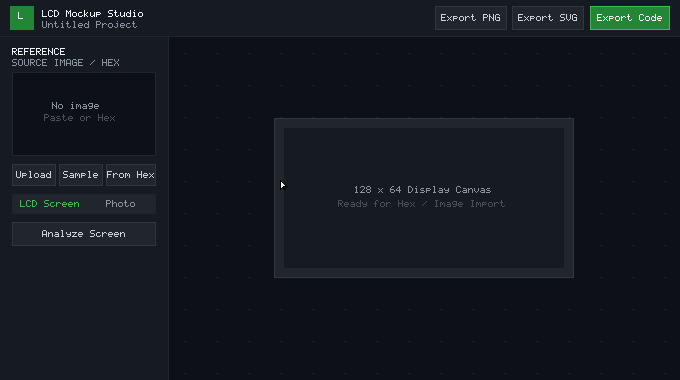
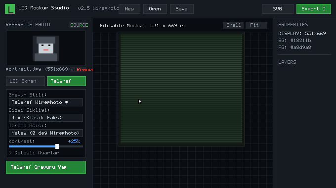

# 📺 LCD Mockup Studio — Embedded Display Designer & C Bitmap Hex Editor
### 🚀 The all-in-one browser tool to convert images to C bitmaps, decode hex bytecode back into images, edit pixels in real-time, and create editable vector mockups for Arduino, ESP32, OLED (SSD1306), Nokia 5110 & LCD displays.

[](https://github.com/MitraZahiri/lcd-mockup-studio/actions/workflows/deploy.yml)
[](https://mitrazahiri.github.io/lcd-mockup-studio/)
[](https://github.com/MitraZahiri/lcd-mockup-studio)
[](LICENSE)

<a href="https://buymeacoffee.com/mitra.zahiri" target="_blank" rel="noopener noreferrer">
  
</a>

**[👉 Launch Studio in Browser (No Install Needed)](https://mitrazahiri.github.io/lcd-mockup-studio/)**  
*100% Client-Side · Zero Server Uploads · Runs Entirely in Your Browser*

<br clear="right" />

<div align="center">



<br /><br />



<br /><br />



</div>

---

## 📟 Live LCD Screen & Telegraphic Wirephoto Representation

```text
┌────────────────────────────────────────────────────────────────────────┐
│  SYSTEM CONTROLLER v2.4                                 CONNECT ᛒ     │
│  AUTOMATIC CYCLE READY                                   ▂ ▄ ▆ █ 📶    │
│  ────────────────────────────────────────────────────────────────────  │
│    CH-1   CH-2   CH-3   CH-4   CH-5   CH-6              [■■■■□] 🔋   │
│  23.5°C                                                  12:30         │
└────────────────────────────────────────────────────────────────────────┘

┌────────────────────────────────────────────────────────────────────────┐
│  TELEGRAPHIC WIREPHOTO FACSIMILE TRANSMISSION (BELINOGRAPH SCAN)       │
│  MODE: 1-BIT SCANLINE ENGRAVING · DENSITY: 3px · CONTRAST: BOOST       │
│  ════════════════════════════════════════════════════════════════════  │
│  ────────────────────────────────────────────────────────────────────  │
│  ───  ──── ── ─── ── ── ─── ─── ── ────── ── ── ── ─── ─── ── ─── ───  │
│  ─ ─ ── ─── ─── ── ─── ── ──── ── ── ─── ─── ── ─── ── ── ─── ── ─ ─   │
│  ── ── ─── ─── ─── ──── ────── ────── ──── ─── ─── ── ── ─── ── ── ──  │
│  ────────────────────────────────────────────────────────────────────  │
│  100% PURE 1-BIT MONOCHROME · NO GRAYSCALE · READY FOR U8G2 / SSD1306  │
└────────────────────────────────────────────────────────────────────────┘
```

Recreating physical LCD and HMI screens for documentation, reverse engineering, and embedded firmware traditionally required measuring pixels by hand, writing cumbersome bitmap conversion scripts, or using outdated desktop tools.

**LCD Mockup Studio combines a modern embedded UI mockup suite with a powerful C Bitmap Generator & Hex Bytecode Editor:**
* 🖼️ **Image to C Bitmap Converter:** Drop any PNG, JPG, BMP, or SVG logo, photo, or icon and instantly convert it into production-ready 1-bit monochrome byte arrays for Arduino, ESP32, STM32, and Raspberry Pi Pico.
* 🔄 **Hex to Image Decoder & Reverse Engineering:** Paste any existing C array (`0x00, 0xFF, ...`), XBM header, or raw hex byte stream from firmware dumps to decode it back into an image with 100% pixel fidelity.
* ✏️ **Interactive Two-Way Pixel Editor (KasperCalc Alternative):** Draw, erase, flood-fill, or toggle bits directly on the live screen preview with instantaneous two-way synchronization to your C code.
* 📐 **Automatic Vectorization & Screen Mockups:** Extract geometry, frames, battery indicators, progress bars, and OCR text into fully editable layered vectors.
* 📦 **Multi-Format Firmware Export:** Instant export to Arduino IDE `.ino` sketches, C headers `.h` (Adafruit_GFX, U8g2 / SSD1306, XBM), MicroPython `framebuf`, JSON, 1:1 Pixel PNG, and vector SVG.

---

## 🏆 Why LCD Mockup Studio? (Feature Comparison)

Looking for a modern **image2cpp**, **LCD Assistant**, or **KasperCalc** alternative? Here is how LCD Mockup Studio compares:

| Feature / Capability | **LCD Mockup Studio** | **image2cpp** | **LCD Assistant** | **KasperCalc** |
| :--- | :---: | :---: | :---: | :---: |
| **Real-Time Code ↔ Canvas Two-Way Sync** | ✅ **Instant Two-Way** | ❌ (One-way export only) | ❌ (Static binary) | ✅ (Web bit editor) |
| **Interactive Pixel Editor (Draw, Erase, Fill, Line, Rect)** | ✅ **Full In-Browser Studio** | ❌ None | ❌ None | ⚠️ Basic bit toggle |
| **Reverse Engineer Existing Hex / C Arrays to Image** | ✅ **1-Click Decoder & Live Edit** | ❌ Not supported | ❌ Not supported | ✅ Supported |
| **AI / Vision OCR & Vectorize from Screen Photos** | ✅ **Full Vector Extraction** | ❌ None | ❌ None | ❌ None |
| **1-Bit Dithering Algorithms** | ✅ **Atkinson, Floyd-Steinberg, Bayer, Telegraphic** | ⚠️ Floyd-Steinberg & Threshold | ⚠️ Threshold only | ❌ None |
| **Microcontroller Formats** | ✅ **Adafruit_GFX, U8g2, XBM, RGB565, MicroPython** | ⚠️ Adafruit_GFX only | ⚠️ Byte / Table only | ⚠️ Byte table |
| **Export Options** | ✅ **Arduino .ino, C .h, PNG, SVG, JSON** | ⚠️ C array only | ⚠️ C array only | ⚠️ C array / Text |
| **Live Display Simulation & Themes** | ✅ **OLED Cyan, Matrix Green, Nokia Teal, Paper** | ❌ Black & White only | ❌ None | ❌ Black & White only |
| **Zero Install / 100% Client-Side Web App** | ✅ **Runs in Browser** | ✅ Runs in Browser | ❌ Windows Desktop .exe | ✅ Runs in Browser |
| **1-Click Shareable Project Permalinks** | ✅ **Lossless Deflate URL** | ❌ None | ❌ None | ❌ None |

---

## 📖 Step-by-Step Quick Recipes

### 1. How to Convert Any Logo or Image to Arduino SSD1306 OLED C Code
1. Open **[LCD Mockup Studio](https://mitrazahiri.github.io/lcd-mockup-studio/)**.
2. Click **Upload** under *Reference Display* on the left, or simply paste an image with <kbd>Ctrl</kbd> + <kbd>V</kbd>.
3. In *Retro Dither / Scanline*, pick your dithering style (**Atkinson** for high-contrast logos, **Floyd-Steinberg** for photos).
4. Click **Export Code** in the top navigation bar.
5. Select your target framework (**Adafruit_GFX**, **U8g2 / SSD1306**, or **MicroPython**).
6. Copy the generated `PROGMEM` array or click **Download Arduino .ino** to flash immediately!

### 2. How to Decode & Edit Existing C Array Hex Code Back into an Image
1. Click **Hex to Image** in the left sidebar or press <kbd>Ctrl</kbd> + <kbd>H</kbd>.
2. Paste any C code array (e.g. `static const unsigned char logo[] = { 0x00, 0xFF, ... };`) or raw hex string.
3. The image is instantly decoded on the live screen preview with 100% pixel fidelity.
4. Click or drag with **✏️ Draw**, **🧹 Erase**, **🪣 Fill**, or **📏 Line** to edit bits directly. The C source code updates synchronously in real time.
5. Click **⭳ Download PNG**, **📋 Copy Image**, or **🖥️ Create Mockup From This** to continue designing.

---

## ⚡ Key Capabilities

* 🚀 **Zero Install Live Web App**: Built with Vite, Canvas, Web Workers, and WebAssembly OCR. Nothing is sent to any server.
* 📥 **Interactive Hex Decoder & Two-Way Bitmap Pixel Editor (KasperCalc Inspired)**:
  * **Real-Time Two-Way Code ↔ Canvas Synchronization**: Click, draw, or erase pixels directly on the screen canvas — your C byte array, XBM header, or hex code in the editor **instantly updates in real time**! Conversely, typing or pasting new hex updates the canvas immediately.
  * **Full Pixel Art & Bitmap Toolkit**:
    * **✏️ Draw (D)**: Set bits to 1 (active) with left-click drag, or erase with right-click.
    * **🧹 Erase (E)**: Clear bits to 0 with left-click drag.
    * **🪣 Flood Fill (F)**: Fill connected 1-bit or 0-bit regions instantly.
    * **📏 Line (L)**: Bresenham straight line drawing with live drag preview.
    * **⬜ Rect (R)**: Geometric rectangle outline tool.
    * **Transformations**: **⟳ 90° Clockwise Rotation** (auto-swaps width/height), **↔ Flip X**, **↕ Flip Y**, **⌽ Invert All Bits**, and **🗑 Clear Canvas**.
    * **Undo & Redo**: 50-step undo history with keyboard shortcuts (`Ctrl+Z`, `Ctrl+Y` / `Ctrl+Shift+Z`).
  * **Precision Hardware Bit & Byte Inspector**:
    * Live inspector status bar displays exact **Cursor coordinates (X, Y)**, **Byte address in hex & dec (`0x00A4 / #164`)**, **Bit index (Bit 0–7)**, **Flat pixel index**, and **Set pixels count with percentage**.
  * **Complete Hardware Format Coverage**:
    * **Adafruit_GFX**: Horizontal MSB-first (.h)
    * **U8g2 / SSD1306**: Vertical 8-px page mode (.h)
    * **XBM**: Horizontal LSB-first (.h)
    * **Vertical MSB**: Column-major MSB-first
    * **RGB565 Color**: 16-bit Big-Endian & Little-Endian for TFT displays
    * **Grayscale**: 8-bit (1 byte per pixel)
  * **Drag & Drop Binary & Text Importer**:
    * Drag & drop `.bmp`, `.bin`, `.xbm`, `.pbm`, `.h`, `.c`, or `.txt` files directly onto the preview canvas. Built-in binary BMP parser handles 1-bit, 8-bit, 24-bit, and 32-bit BMP files automatically.
  * **Interactive Screen Emulation**: Switch between OLED Cyan, Matrix Green, Amber Yellow, Nokia Teal, or custom themes; toggle pixel grids, and zoom from 1× up to 16×.
  * **Seamless Studio Actions & Full Vectorization**:
    * **🖥️ Create Editable Mockup From This**: Automatically updates display size, saves the decoded image as a persistent 1:1 trace reference, and runs computer vision to vectorize the screen into fully editable Text, Rectangle frames, Lines, and Symbol layers!
    * **Layer Bitmap Controls**: Fine-tune with 1-click Invert, Recolor/Tint to theme color, Opacity slider (10%–100%), or convert to editable vector elements.
    * Copy decoded image to clipboard, download PNG, or insert as canvas layer.
* 📡 **1-Bit Retro Wirephoto & Telegraphic Scanline Engraving Engine**:
  * Transform real photographic portraits, faces, and technical schematics into authentic 20th-century **Belinograph facsimile & wirephoto scanline engravings**.
  * **Dynamic Thickness Modulation**: Modulates scanline stroke weight and thickness in real-time based on local image luminance and darkness gradients.
  * **4 Distinct Historical Scan Patterns**:
    * **Horizontal (0°)**: Classic 1920s newspaper wirephoto and CRT television raster scanlines.
    * **Diagonal (45°)**: Vintage banknote, currency, and copperplate etching cross-hatch engraving.
    * **Crosshatch Grid**: Interlocking orthogonal lines for deep shadows and dramatic shading.
    * **Morse / Pulse Raster**: Dashes and dots simulating telegraphic radio-photo bursts.
  * **Interactive Laser Sweep**: Visualizes real-time scanline engraving progression with animated laser sweeps.
  * **Embedded-Ready**: Generates ultra-crisp 1-bit bitmaps ready for Adafruit_GFX, U8g2, and MicroPython on SSD1306 OLEDs and e-Paper displays.
* 🖼️ **1-Bit Retro Photo & Portrait Dither Engine**:
  * Convert any real photograph, portrait, selfie, logo, or artwork into ultra-detailed 1-bit monochrome pixel art without OCR hallucinations or broken rectangular artifacts.
  * **Legendary Dithering Algorithms**:
    * **Atkinson Dither**: Developed by Bill Atkinson for the original 1984 Apple Macintosh & GameBoy Camera — preserves high contrast and clean whites, ideal for human faces and avatars.
    * **Floyd-Steinberg Dither**: Smooth photographic error-diffusion for natural gradients and skin tones.
    * **Bayer 4×4 & 8×8 Ordered Matrix**: Vintage CRT / newspaper halftone cross-hatch shading.
    * **Ink Stamp Stencil**: High-contrast graphic contour styling.
  * Real-time sliders for **Contrast**, **Brightness**, **Threshold**, and **Polarity Inversion** (Dark OLED vs. Light e-Paper).
  * Direct 1-click full screen conversion or insert as an **Avatar Layer** alongside vector text and stencils.
* 🔗 **1-Click Viral URL Sharing (Zero-Backend Permalinks)**:
  * Lossless `CompressionStream('deflate-raw')` compression packs complete projects directly into URL hashes. Share mockups with a single link without needing servers or databases.
* 🔘 **Hardware Realistic Breakout PCB Simulator**:
  * Simulates physical breakout boards for **SSD1306 OLED**, **Nokia 5110 (PCD8544)**, and **HD44780 Character LCDs** with realistic gold-plated header pins (GND, VCC, SCL, SDA), corner mounting screws, and subtle glass glare reflections.
* ▶ **Live Interactive Simulation Mode**:
  * Real-time hardware preview with ticking clocks (blinking `:` colons), fluctuating temperature/voltage telemetry jitter, and animated battery / progress bar sweeps. Non-destructive: original values restore seamlessly on stop.
* 📋 **Global Clipboard Paste (`Ctrl + V`)**: Copy any screenshot with Snipping Tool or browser and press `Ctrl + V` to load instantly.
* 🧪 **1-Click Interactive Gallery**: Test right away with built-in realistic LCD samples (Industrial HMI, 3D Printer Marlin, IoT OLED Weather Station).
* 🔍 **Intelligent Computer Vision Pipeline**:
  * **Text & Segment OCR**: Recognizes dot-matrix and 7-segment digits, clock times, telemetry units (`°C`, `%`, `hPa`, `RPM`, `V`, `A`), and labels.
  * **Geometry & Shapes**: Automatically extracts border frames, dividing lines, circular indicators, and solid badges.
  * **Dedicated LCD Symbols**: Detects ascending Wi-Fi/cellular signal bars, battery meters with internal charge level, directional arrows, locks, and checkboxes.
  * **Color Palette Auto-Adoption**: Automatically samples display background and foreground pixel colors from the photo.
* 💻 **Unified Multi-Format Code Export ("Export Code" Modal)**:
  * Click **"Export Code"** in the top navigation bar to access instant exports across 5 interactive tabs:
    * **C / C++ Code**: Adafruit_GFX (`.h`), U8g2 (`.h`), XBM (`.h`), and complete Arduino Sketch (`.ino`) with live monochrome hardware preview and polarity inversion.
    * **JSON Code**: Complete project schema (`.json`) with all vector layers, geometries, and fonts, or canvas elements array only.
    * **Hex Code**: C byte array (`0x00, 0xFF, ...`), space-separated byte pairs (`00 FF ...`), formatted hex dump with offsets, and continuous raw hex stream.
    * **MicroPython Script (`.py`)**: Generates `framebuf.FrameBuffer(bytearray([...]), ...)` ready for ESP32 and Raspberry Pi Pico.
    * **Base64 / Data URI**: Direct Web Data URI (`data:image/png;base64,...`), raw base64 string, and HTML `` tag ready to paste into web apps.
  * Real-time 1-click **Copy to Clipboard** and **Download File** (`.h`, `.json`, `.hex`, `.py`, `.txt`) for all formats.
* 🎛️ **Target Hardware Display Presets**:
  * 1-Click dimensions and color mapping for **SSD1306** (128×64 & 128×32 OLED), **ST7920** (128×64 Graphic LCD), **PCD8544** (Nokia 5110), **HD44780** (16×2 Character LCD), and **ST7789** (240×240 IPS).
* 🖼️ **Custom PNG Logo & Asset Layers**: Insert company logos, device icons, or graphic sprites directly via the **"🖼️ Image / Logo"** tool or by dragging and dropping PNG/SVG/JPG files onto the canvas. Fully resizable and draggable with dedicated controls for Opacity, Invert, Recolor/Tint to match the display theme, and 1-click vector conversion.
* 📐 **Vector & Document Export**:
  * **SVG Vector Export**: Scalable vector graphics with precise clip paths for manuals, datasheets, and schematics.
  * **Native PNG Export**: Pixel-for-pixel hardware resolution preservation.
  * **Project Files (`.lcd.json`)**: Save full project state with layers, grid, and reference images.
* ⌨️ **Pro Studio Productivity**:
  * Global clipboard paste (`Ctrl + V`), element nudging via Arrow keys, duplicate (`Ctrl + D`), undo/redo, and interactive keyboard shortcut guide (`?`).

---

## 🔄 The Pipeline

```text
   [ Reference Photo / Clipboard ]         [ C Array / Hex / XBM ]
                  │                                   │
   ┌──────────────┴──────────────┐                    ▼
   ▼                             ▼        ┌────────────────────────┐
┌──────────────────────────┐  ┌───────────│ 📥 Hex-to-Image Engine │
│  Computer Vision (OCR)   │  │  1-Bit    │ • Adafruit / U8g2 / XBM│
│  • Auto Palette Extract  │  │  Photo &  │ • RGB565 / Grayscale   │
│  • Connected Components  │  │  Wirephoto│ • Auto-Detect Res & HW │
│  • Shape/Symbol Detect   │  │  Engraving└───────────┬────────────┘
│  • Tesseract.js Text     │  │  Engine               │
└──────────────┬───────────┘  └─────┬─────────────────┘
               │                    │                 │
               └──────────────┬─────┴─────────────────┘
                              ▼
                [ Interactive Vector Canvas ]
                              │
                ┌─────────────┼──────────────┐
                ▼             ▼              ▼
           [ C Header ]    [ SVG ]        [ PNG ]
           (U8g2/Adafruit) (Vector)       (1:1 Pixel)
```

---

## 💻 Microcontroller C Code Generation

Exporting mockups directly into embedded C headers eliminates manual bitmap conversions:

```c
// Example generated U8g2 monochrome bitmap array (128x64)
#include <U8g2lib.h>

const uint8_t lcd_display_bitmap[] PROGMEM = {
  0x00, 0x1f, 0x00, 0x00, 0x00, 0x3e, 0x00, 0x00,
  0xff, 0xff, 0xff, 0xff, 0x00, 0x00, 0x7c, 0x18,
  // ... packed 1-bit monochrome pages
};

void drawScreen(U8G2 &u8g2) {
  u8g2.drawXBMP(0, 0, 128, 64, lcd_display_bitmap);
}
```

---

## ⌨️ Keyboard Shortcuts

| Shortcut | Action |
| :--- | :--- |
| `Ctrl / Cmd + V` | **Paste image from clipboard as reference** |
| `Delete` / `Backspace` | Delete selected element |
| `Ctrl / Cmd + Z` | Undo last change |
| `Ctrl / Cmd + Shift + Z` / `Ctrl + Y` | Redo change |
| `Ctrl / Cmd + D` | Duplicate element |
| `Ctrl / Cmd + C` | Copy element |
| `Arrow Keys` | Nudge element by 1 px (`Shift + Arrow` for 5 px) |
| `]` / `PageUp` | Bring layer forward (`Shift + ]` to Front) |
| `[` / `PageDown` | Send layer backward (`Shift + [` to Back) |
| `Ctrl / Cmd + S` | Save project (`.lcd.json`) |

---

## 🛠️ Run Locally

```bash
# Clone the repository
git clone https://github.com/MitraZahiri/lcd-mockup-studio.git
cd lcd-mockup-studio

# Install dependencies
npm install

# Start local Vite development server
npm run dev

# Run test suite (97 unit tests)
npm test

# Build production bundle
npm run build
```

---

## 🤝 Contributing

Contributions, bug reports, and suggestions are warmly welcome! Please check out [CONTRIBUTING.md](CONTRIBUTING.md) to get started.

---

## ☕ Support the Project

If **LCD Mockup Studio** saved you time designing embedded displays, editing bitmaps, or writing Arduino/ESP32 C firmware, consider supporting its open-source development!

<a href="https://buymeacoffee.com/mitra.zahiri" target="_blank" rel="noopener noreferrer">
  
</a>

* ☕ **Buy Me a Coffee:** [buymeacoffee.com/mitra.zahiri](https://buymeacoffee.com/mitra.zahiri)
* ⭐ **Star on GitHub:** Star the project on [GitHub](https://github.com/MitraZahiri/lcd-mockup-studio) to help other makers find it!

---

## 👤 Author

**Mitra Zahiri**  
*Software Engineer · Interactive & Connected Products*  
* [GitHub Profile](https://github.com/MitraZahiri)
* [LinkedIn](https://www.linkedin.com/in/mitra-zahiri)
* [Behance](https://www.behance.net/mitrazahiri98)

---

## 📜 License

[MIT](LICENSE) © 2026 Mitra Zahiri
